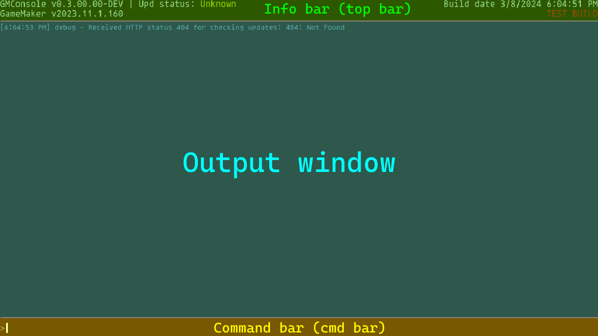

# Basics
This will go over the basics of the console's features.  

 This page is made for both users and developers.

---
#### Table of contents:
- [Interface](#interface)  
  - [Info bar](#interface:info-bar)
  - [Output window](#interface:output-window)
  - [Command bar](#cmd-bar)

---
## <a name="interface">Interface</a>

GMConsole has a clear and colorful logs in a simple UI.

It has 3 parts: the info bar (top bar), the output window, and the command bar (cmd bar).  
(This screenshot is from v0.3.00.00-dev, some text might have been changed.)
<!-- Fun fact: I had to redo this 3 times because I kept on changing strings for 0.3.00.00 (as it's the first public release) --->

### <a name="interface:info-bar">Info bar</a>
The info bar contains these fields:
- GMConsole's version, and it's update status* (top left)
- GameMaker's version (right below GMConsole's)
- The time where the game was compiled (top right)
- If the build is a test build, a release build (VM), or a compiled build (YYC) (right below the build date)

### <a name="interface:output-window">Output window</a>
The output window is where you will be able to see the console's output.  
By example, a log at 10:00:04 AM that says "This is my message!" would look like:  

> \[10:00:04 AM\] log - This is my message!

The output window also supports multi-line message, and colors text based on what it is, here's an example of what a multi-line error would look like:  

> \[12:34:56 PM\] error - This is an example error message
that spans over multiple messages!

### <a name="interface:cmd-bar">Command bar</a>
The command bar is one of the main parts of the console.  
This is where you input your commands. Here is an example of what happens in the output when typing the built-in command `about` and pressing enter:  
> \[12:34:56 PM\] >about  
> \[12:34:56 PM\] log - Command returned string:  
> GMConsole v0.3.00.00-dev (Update status: Up to date)  
> Made with \<3 by Reycko  
> You are on branch master (based on version name)  
> Use command \`github\` to open the GitHub repo!  
